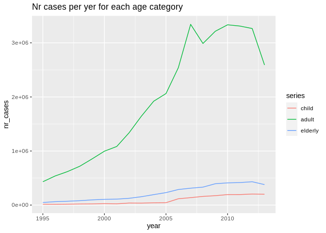
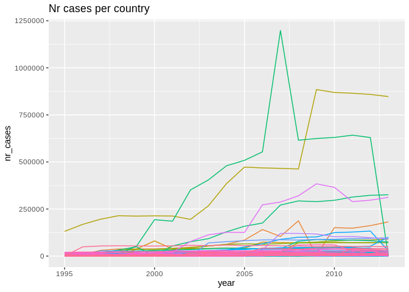

    library(EDAWR)
    library(dplyr)
    library(knitr)
    library(ggplot2)
    library(reshape2)

\#\#Wczytywanie danych.

    data <- data.frame(tb)
    knitr::kable(head(data))

<table>
<thead>
<tr class="header">
<th style="text-align: left;">country</th>
<th style="text-align: right;">year</th>
<th style="text-align: left;">sex</th>
<th style="text-align: right;">child</th>
<th style="text-align: right;">adult</th>
<th style="text-align: right;">elderly</th>
</tr>
</thead>
<tbody>
<tr class="odd">
<td style="text-align: left;">Afghanistan</td>
<td style="text-align: right;">1995</td>
<td style="text-align: left;">female</td>
<td style="text-align: right;">NA</td>
<td style="text-align: right;">NA</td>
<td style="text-align: right;">NA</td>
</tr>
<tr class="even">
<td style="text-align: left;">Afghanistan</td>
<td style="text-align: right;">1995</td>
<td style="text-align: left;">male</td>
<td style="text-align: right;">NA</td>
<td style="text-align: right;">NA</td>
<td style="text-align: right;">NA</td>
</tr>
<tr class="odd">
<td style="text-align: left;">Afghanistan</td>
<td style="text-align: right;">1996</td>
<td style="text-align: left;">female</td>
<td style="text-align: right;">NA</td>
<td style="text-align: right;">NA</td>
<td style="text-align: right;">NA</td>
</tr>
<tr class="even">
<td style="text-align: left;">Afghanistan</td>
<td style="text-align: right;">1996</td>
<td style="text-align: left;">male</td>
<td style="text-align: right;">NA</td>
<td style="text-align: right;">NA</td>
<td style="text-align: right;">NA</td>
</tr>
<tr class="odd">
<td style="text-align: left;">Afghanistan</td>
<td style="text-align: right;">1997</td>
<td style="text-align: left;">female</td>
<td style="text-align: right;">5</td>
<td style="text-align: right;">96</td>
<td style="text-align: right;">1</td>
</tr>
<tr class="even">
<td style="text-align: left;">Afghanistan</td>
<td style="text-align: right;">1997</td>
<td style="text-align: left;">male</td>
<td style="text-align: right;">0</td>
<td style="text-align: right;">26</td>
<td style="text-align: right;">0</td>
</tr>
</tbody>
</table>

\#\#Krótkie podsumowanie.

    knitr::kable(summary(data))

<table style="width:100%;">
<colgroup>
<col style="width: 3%" />
<col style="width: 17%" />
<col style="width: 13%" />
<col style="width: 17%" />
<col style="width: 16%" />
<col style="width: 15%" />
<col style="width: 17%" />
</colgroup>
<thead>
<tr class="header">
<th style="text-align: left;"></th>
<th style="text-align: left;">country</th>
<th style="text-align: left;">year</th>
<th style="text-align: left;">sex</th>
<th style="text-align: left;">child</th>
<th style="text-align: left;">adult</th>
<th style="text-align: left;">elderly</th>
</tr>
</thead>
<tbody>
<tr class="odd">
<td style="text-align: left;"></td>
<td style="text-align: left;">Length:3800</td>
<td style="text-align: left;">Min. :1995</td>
<td style="text-align: left;">Length:3800</td>
<td style="text-align: left;">Min. : 0.0</td>
<td style="text-align: left;">Min. : 0</td>
<td style="text-align: left;">Min. : 0.0</td>
</tr>
<tr class="even">
<td style="text-align: left;"></td>
<td style="text-align: left;">Class :character</td>
<td style="text-align: left;">1st Qu.:1999</td>
<td style="text-align: left;">Class :character</td>
<td style="text-align: left;">1st Qu.: 25.0</td>
<td style="text-align: left;">1st Qu.: 1128</td>
<td style="text-align: left;">1st Qu.: 84.5</td>
</tr>
<tr class="odd">
<td style="text-align: left;"></td>
<td style="text-align: left;">Mode :character</td>
<td style="text-align: left;">Median :2004</td>
<td style="text-align: left;">Mode :character</td>
<td style="text-align: left;">Median : 76.0</td>
<td style="text-align: left;">Median : 2589</td>
<td style="text-align: left;">Median : 230.0</td>
</tr>
<tr class="even">
<td style="text-align: left;"></td>
<td style="text-align: left;">NA</td>
<td style="text-align: left;">Mean :2004</td>
<td style="text-align: left;">NA</td>
<td style="text-align: left;">Mean : 493.2</td>
<td style="text-align: left;">Mean : 10864</td>
<td style="text-align: left;">Mean : 1253.0</td>
</tr>
<tr class="odd">
<td style="text-align: left;"></td>
<td style="text-align: left;">NA</td>
<td style="text-align: left;">3rd Qu.:2009</td>
<td style="text-align: left;">NA</td>
<td style="text-align: left;">3rd Qu.: 264.5</td>
<td style="text-align: left;">3rd Qu.: 6706</td>
<td style="text-align: left;">3rd Qu.: 640.0</td>
</tr>
<tr class="even">
<td style="text-align: left;"></td>
<td style="text-align: left;">NA</td>
<td style="text-align: left;">Max. :2013</td>
<td style="text-align: left;">NA</td>
<td style="text-align: left;">Max. :25661.0</td>
<td style="text-align: left;">Max. :731540</td>
<td style="text-align: left;">Max. :125991.0</td>
</tr>
<tr class="odd">
<td style="text-align: left;"></td>
<td style="text-align: left;">NA</td>
<td style="text-align: left;">NA</td>
<td style="text-align: left;">NA</td>
<td style="text-align: left;">NA’s :396</td>
<td style="text-align: left;">NA’s :413</td>
<td style="text-align: left;">NA’s :413</td>
</tr>
</tbody>
</table>

\#\#Liczba zachorowań z podziałem na płeć.

    data_sex <- group_by(data,sex)
    data_sex <-summarise_at(data_sex,vars("child","adult","elderly"),funs(sum),na.rm=TRUE)
    data_sex$sum<- rowSums(data_sex[,c("child", "adult", "elderly")])
    knitr::kable(data_sex[, c("sex","sum")])

<table>
<thead>
<tr class="header">
<th style="text-align: left;">sex</th>
<th style="text-align: right;">sum</th>
</tr>
</thead>
<tbody>
<tr class="odd">
<td style="text-align: left;">female</td>
<td style="text-align: right;">15656162</td>
</tr>
<tr class="even">
<td style="text-align: left;">male</td>
<td style="text-align: right;">27062807</td>
</tr>
</tbody>
</table>

\#\#Wykres liczby zachorowań wśórd dzieci, dorosłych oraz osób
starszych.

    data_year <- group_by(data,year)
    data_year <-summarise_at(data_year,vars("child","adult","elderly"),funs(sum),na.rm=TRUE)
    data_year<- melt(data_year ,  id.vars = 'year', variable.name = 'series')

    g_plot <- ggplot(data_year, aes(year,value)) + geom_line(aes(colour = series))+
      xlab("year")+
      ylab("nr_cases")+
      ggtitle("Nr cases per yer for each age category")
    g_plot

\#\#Wykresy z podziałem na kraje.

    data_year_country <- group_by(data,year,country)

    data_year_country <-summarise_at(data_year_country,vars("child","adult","elderly"),funs(sum),na.rm=TRUE)

    data_year_country_melted <- melt(data_year_country ,  id.vars = c('year','country'), variable.name = 'series')
    data_agregated <-aggregate(data_year_country_melted$value,by=list(year=data_year_country_melted$year,country=data_year_country_melted$country),FUN=sum)

    countries <- unique(as.vector(as.matrix(data_year_country_melted["country"])))
    years <- unique(as.vector(as.matrix(data_year_country_melted["year"])))

    plot <- ggplot(data = data_agregated, aes(x = year, y=x, group=country)) + 
      geom_line(aes(color=country), show.legend = FALSE) +
      xlab("year")+
      ylab("nr_cases")+
      ggtitle("Nr cases per country")
    plot

