    library(EDAWR)
    library(dplyr)
    library(knitr)
    library(ggplot2)
    library(reshape2)

\#\#Wczytywanie danych.

    data <- data.frame(diamonds)
    knitr::kable(head(data))

<table>
<thead>
<tr class="header">
<th style="text-align: right;">carat</th>
<th style="text-align: left;">cut</th>
<th style="text-align: left;">color</th>
<th style="text-align: left;">clarity</th>
<th style="text-align: right;">depth</th>
<th style="text-align: right;">table</th>
<th style="text-align: right;">price</th>
<th style="text-align: right;">x</th>
<th style="text-align: right;">y</th>
<th style="text-align: right;">z</th>
</tr>
</thead>
<tbody>
<tr class="odd">
<td style="text-align: right;">0.23</td>
<td style="text-align: left;">Ideal</td>
<td style="text-align: left;">E</td>
<td style="text-align: left;">SI2</td>
<td style="text-align: right;">61.5</td>
<td style="text-align: right;">55</td>
<td style="text-align: right;">326</td>
<td style="text-align: right;">3.95</td>
<td style="text-align: right;">3.98</td>
<td style="text-align: right;">2.43</td>
</tr>
<tr class="even">
<td style="text-align: right;">0.21</td>
<td style="text-align: left;">Premium</td>
<td style="text-align: left;">E</td>
<td style="text-align: left;">SI1</td>
<td style="text-align: right;">59.8</td>
<td style="text-align: right;">61</td>
<td style="text-align: right;">326</td>
<td style="text-align: right;">3.89</td>
<td style="text-align: right;">3.84</td>
<td style="text-align: right;">2.31</td>
</tr>
<tr class="odd">
<td style="text-align: right;">0.23</td>
<td style="text-align: left;">Good</td>
<td style="text-align: left;">E</td>
<td style="text-align: left;">VS1</td>
<td style="text-align: right;">56.9</td>
<td style="text-align: right;">65</td>
<td style="text-align: right;">327</td>
<td style="text-align: right;">4.05</td>
<td style="text-align: right;">4.07</td>
<td style="text-align: right;">2.31</td>
</tr>
<tr class="even">
<td style="text-align: right;">0.29</td>
<td style="text-align: left;">Premium</td>
<td style="text-align: left;">I</td>
<td style="text-align: left;">VS2</td>
<td style="text-align: right;">62.4</td>
<td style="text-align: right;">58</td>
<td style="text-align: right;">334</td>
<td style="text-align: right;">4.20</td>
<td style="text-align: right;">4.23</td>
<td style="text-align: right;">2.63</td>
</tr>
<tr class="odd">
<td style="text-align: right;">0.31</td>
<td style="text-align: left;">Good</td>
<td style="text-align: left;">J</td>
<td style="text-align: left;">SI2</td>
<td style="text-align: right;">63.3</td>
<td style="text-align: right;">58</td>
<td style="text-align: right;">335</td>
<td style="text-align: right;">4.34</td>
<td style="text-align: right;">4.35</td>
<td style="text-align: right;">2.75</td>
</tr>
<tr class="even">
<td style="text-align: right;">0.24</td>
<td style="text-align: left;">Very Good</td>
<td style="text-align: left;">J</td>
<td style="text-align: left;">VVS2</td>
<td style="text-align: right;">62.8</td>
<td style="text-align: right;">57</td>
<td style="text-align: right;">336</td>
<td style="text-align: right;">3.94</td>
<td style="text-align: right;">3.96</td>
<td style="text-align: right;">2.48</td>
</tr>
</tbody>
</table>

\#\#Krótkie podsumowanie.

    knitr::kable(summary(data))

<table>
<colgroup>
<col style="width: 2%" />
<col style="width: 10%" />
<col style="width: 11%" />
<col style="width: 5%" />
<col style="width: 9%" />
<col style="width: 9%" />
<col style="width: 9%" />
<col style="width: 9%" />
<col style="width: 10%" />
<col style="width: 10%" />
<col style="width: 10%" />
</colgroup>
<thead>
<tr class="header">
<th style="text-align: left;"></th>
<th style="text-align: left;">carat</th>
<th style="text-align: left;">cut</th>
<th style="text-align: left;">color</th>
<th style="text-align: left;">clarity</th>
<th style="text-align: left;">depth</th>
<th style="text-align: left;">table</th>
<th style="text-align: left;">price</th>
<th style="text-align: left;">x</th>
<th style="text-align: left;">y</th>
<th style="text-align: left;">z</th>
</tr>
</thead>
<tbody>
<tr class="odd">
<td style="text-align: left;"></td>
<td style="text-align: left;">Min. :0.2000</td>
<td style="text-align: left;">Fair : 1610</td>
<td style="text-align: left;">D: 6775</td>
<td style="text-align: left;">SI1 :13065</td>
<td style="text-align: left;">Min. :43.00</td>
<td style="text-align: left;">Min. :43.00</td>
<td style="text-align: left;">Min. : 326</td>
<td style="text-align: left;">Min. : 0.000</td>
<td style="text-align: left;">Min. : 0.000</td>
<td style="text-align: left;">Min. : 0.000</td>
</tr>
<tr class="even">
<td style="text-align: left;"></td>
<td style="text-align: left;">1st Qu.:0.4000</td>
<td style="text-align: left;">Good : 4906</td>
<td style="text-align: left;">E: 9797</td>
<td style="text-align: left;">VS2 :12258</td>
<td style="text-align: left;">1st Qu.:61.00</td>
<td style="text-align: left;">1st Qu.:56.00</td>
<td style="text-align: left;">1st Qu.: 950</td>
<td style="text-align: left;">1st Qu.: 4.710</td>
<td style="text-align: left;">1st Qu.: 4.720</td>
<td style="text-align: left;">1st Qu.: 2.910</td>
</tr>
<tr class="odd">
<td style="text-align: left;"></td>
<td style="text-align: left;">Median :0.7000</td>
<td style="text-align: left;">Very Good:12082</td>
<td style="text-align: left;">F: 9542</td>
<td style="text-align: left;">SI2 : 9194</td>
<td style="text-align: left;">Median :61.80</td>
<td style="text-align: left;">Median :57.00</td>
<td style="text-align: left;">Median : 2401</td>
<td style="text-align: left;">Median : 5.700</td>
<td style="text-align: left;">Median : 5.710</td>
<td style="text-align: left;">Median : 3.530</td>
</tr>
<tr class="even">
<td style="text-align: left;"></td>
<td style="text-align: left;">Mean :0.7979</td>
<td style="text-align: left;">Premium :13791</td>
<td style="text-align: left;">G:11292</td>
<td style="text-align: left;">VS1 : 8171</td>
<td style="text-align: left;">Mean :61.75</td>
<td style="text-align: left;">Mean :57.46</td>
<td style="text-align: left;">Mean : 3933</td>
<td style="text-align: left;">Mean : 5.731</td>
<td style="text-align: left;">Mean : 5.735</td>
<td style="text-align: left;">Mean : 3.539</td>
</tr>
<tr class="odd">
<td style="text-align: left;"></td>
<td style="text-align: left;">3rd Qu.:1.0400</td>
<td style="text-align: left;">Ideal :21551</td>
<td style="text-align: left;">H: 8304</td>
<td style="text-align: left;">VVS2 : 5066</td>
<td style="text-align: left;">3rd Qu.:62.50</td>
<td style="text-align: left;">3rd Qu.:59.00</td>
<td style="text-align: left;">3rd Qu.: 5324</td>
<td style="text-align: left;">3rd Qu.: 6.540</td>
<td style="text-align: left;">3rd Qu.: 6.540</td>
<td style="text-align: left;">3rd Qu.: 4.040</td>
</tr>
<tr class="even">
<td style="text-align: left;"></td>
<td style="text-align: left;">Max. :5.0100</td>
<td style="text-align: left;">NA</td>
<td style="text-align: left;">I: 5422</td>
<td style="text-align: left;">VVS1 : 3655</td>
<td style="text-align: left;">Max. :79.00</td>
<td style="text-align: left;">Max. :95.00</td>
<td style="text-align: left;">Max. :18823</td>
<td style="text-align: left;">Max. :10.740</td>
<td style="text-align: left;">Max. :58.900</td>
<td style="text-align: left;">Max. :31.800</td>
</tr>
<tr class="odd">
<td style="text-align: left;"></td>
<td style="text-align: left;">NA</td>
<td style="text-align: left;">NA</td>
<td style="text-align: left;">J: 2808</td>
<td style="text-align: left;">(Other): 2531</td>
<td style="text-align: left;">NA</td>
<td style="text-align: left;">NA</td>
<td style="text-align: left;">NA</td>
<td style="text-align: left;">NA</td>
<td style="text-align: left;">NA</td>
<td style="text-align: left;">NA</td>
</tr>
</tbody>
</table>

\#\#Wykres z depth.

    plot <- ggplot(data = data) + 
      geom_histogram(aes(depth),data=data , col=I("blue"),show.legend = FALSE) +
      ggtitle("Depth Histogram")
    plot

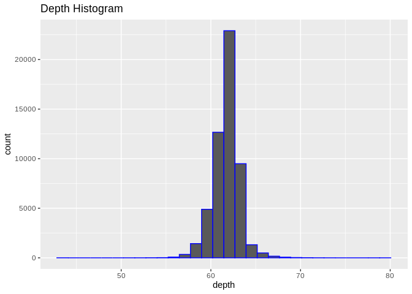

\#\#Wykres z depth, szerokość kubełka.

    plot <- ggplot(data = data) + 
      geom_histogram(aes(depth),data=data , col=I("blue"),show.legend = FALSE,binwidth=0.2) +
      ggtitle("Depth Histogram bindwith=0.2")
    plot

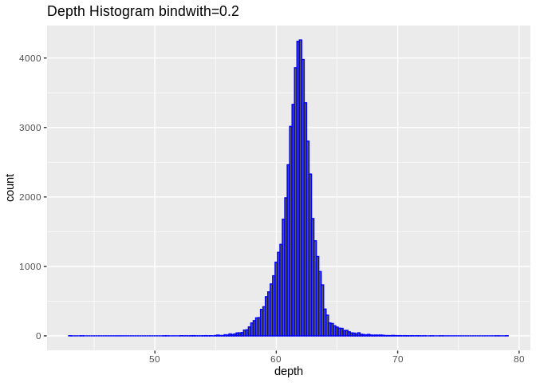
\#\#Wykres z depth, szerokość kubełka, oś w przedziale \[55,70\].

    plot <- ggplot(data = data) + 
      geom_histogram(aes(depth),data=data , col=I("blue"),show.legend = FALSE,binwidth=0.2) +
      xlim(55,70)+
      ggtitle("Depth Histogram xlim(55,70)")
    plot

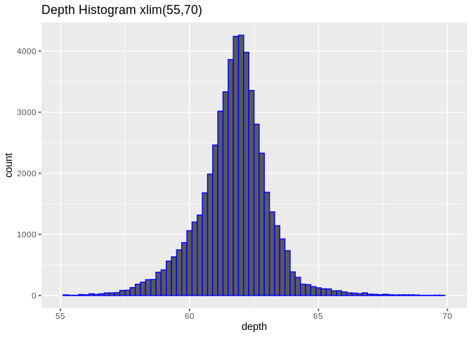 \#\#Wpływ
zmiennej CUT za pomoca koloru.

    plot <- ggplot(data) + 
      geom_histogram(aes(depth,color=cut),binwidth=0.2) +
      xlim(55,70)+
      ggtitle("Depth Histogram Color by Cut")
    plot

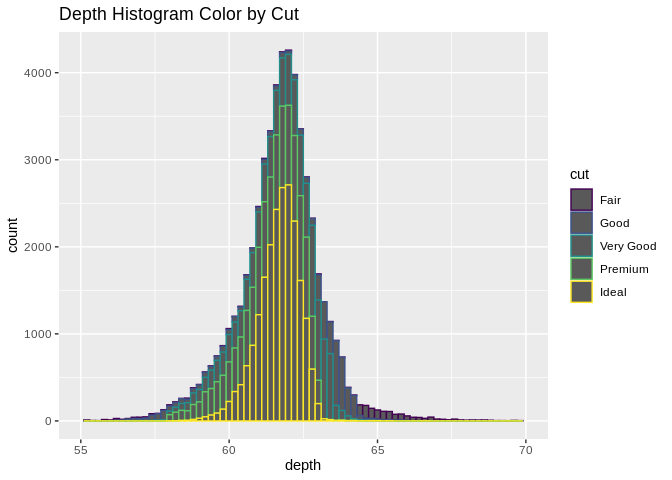

\#\#Wpływ zmiennej CUT za pomoca paneli

    plot <- ggplot(data = data) + 
      geom_histogram(aes(depth),data=data , col=I("blue"),show.legend = FALSE,binwidth=0.2) +
      xlim(55,70)+
      facet_wrap(~cut)+
      ggtitle("Depth Histogram panels by cut")
    plot

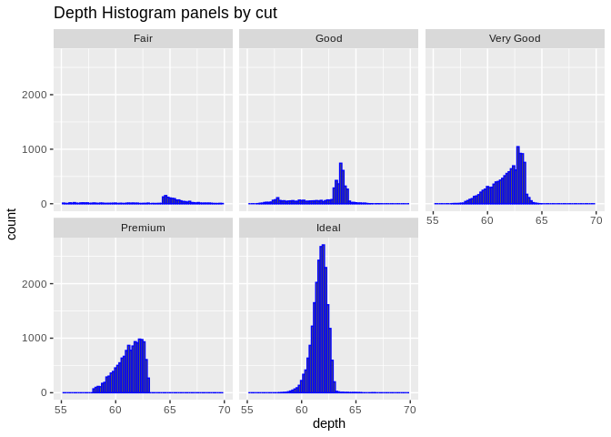

\#\#Powtórka dla price

    plot <- ggplot(data = data) + 
      geom_histogram(aes(price),data=data , col=I("blue"),show.legend = FALSE) +
      ggtitle("Price Histogram")
    plot

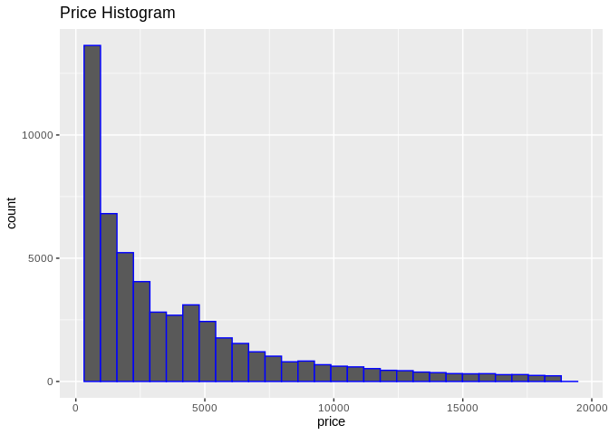

\#\#Wykres z price, szerokość kubełka.

    plot <- ggplot(data = data) + 
      geom_histogram(aes(price),data=data , col=I("blue"),show.legend = FALSE,binwidth=250) +
      ggtitle("Price Histogram binwidth=250")
    plot

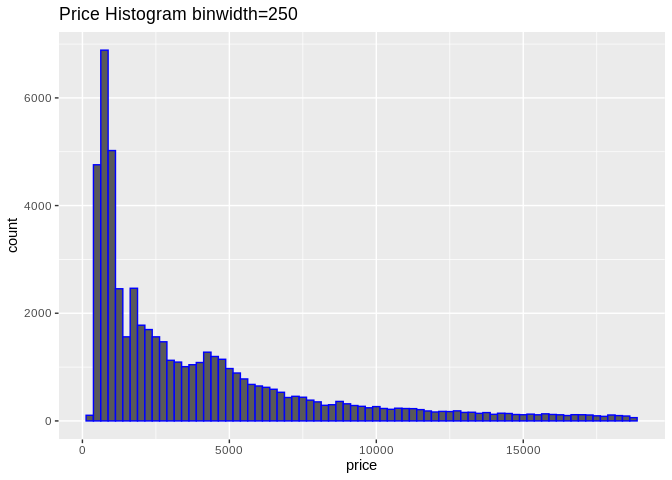 \#\#Wykres z
price, szerokość kubełka, oś w przedziale \[55,70\].

    plot <- ggplot(data = data) + 
      geom_histogram(aes(price),data=data , col=I("blue"),show.legend = FALSE,binwidth=250) +
      xlim(0,6000)+
      ggtitle("Price Histogram")
    plot

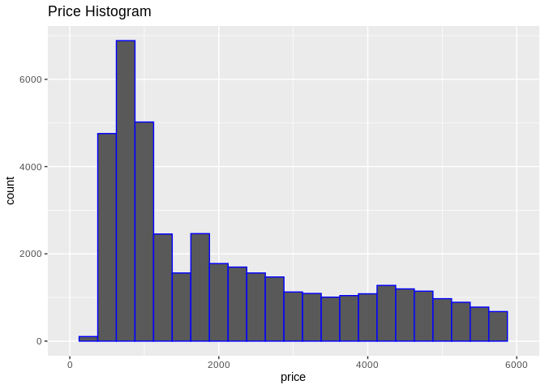 \#\#Wpływ
zmiennej CUT za pomoca koloru.

    plot <- ggplot(data) + 
      geom_histogram(aes(price,color=cut),binwidth=250) +
      xlim(0,6000)+
      ggtitle("Price Histogram Color by Cut")
    plot

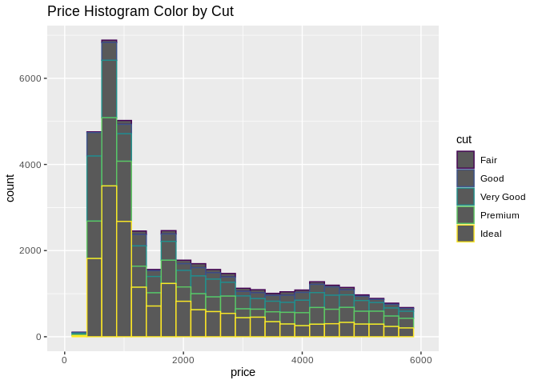

\#\#Wpływ zmiennej CUT za pomoca paneli

    plot <- ggplot(data = data) + 
      geom_histogram(aes(price),data=data , col=I("blue"),show.legend = FALSE,binwidth=250) +
      xlim(0,6000)+
      facet_wrap(~cut)+
      ggtitle("Price Histogram Panels by CUt")
    plot

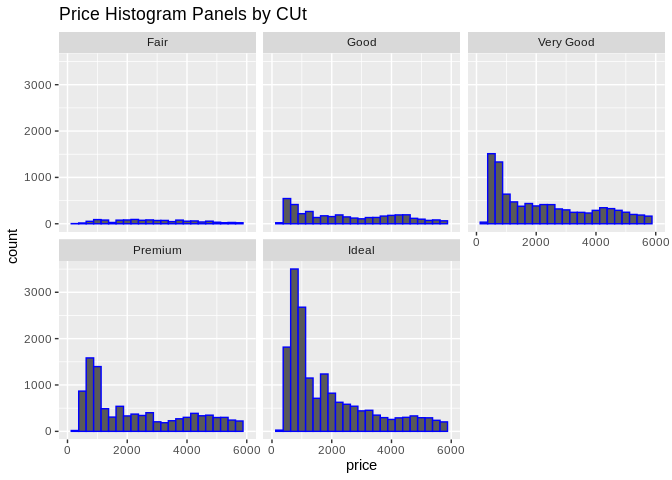

\#\#Relacja Carat - price

    plot <- ggplot(data = data,aes(price,carat,color=clarity)) + 
      geom_point(alpha = 1/10) +
      ggtitle("Price-Carat ")
    plot

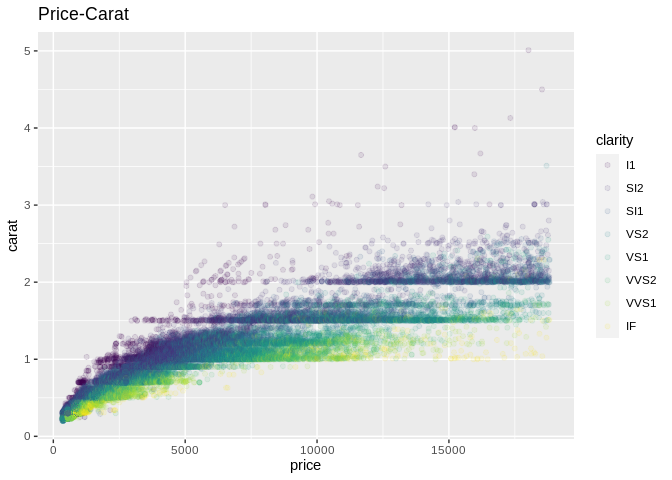

\#\#Relacja Carat - price lower\_density

    sample <- data[sample(nrow(data),2000),]
    plot <- ggplot(data = sample,aes(price,carat,color=clarity)) + 
      geom_point(alpha = 1) +
      ggtitle("Price-Carat 2k sample ")
    plot

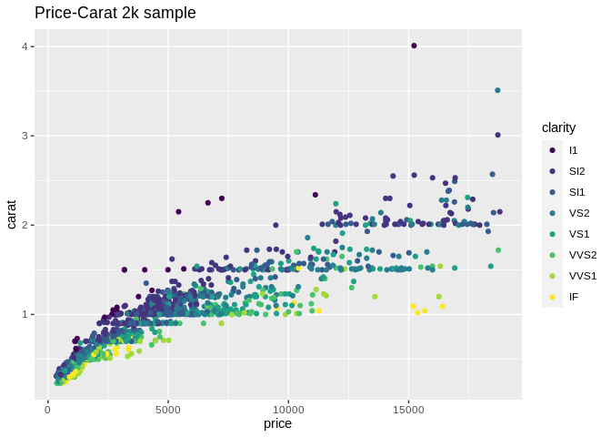
