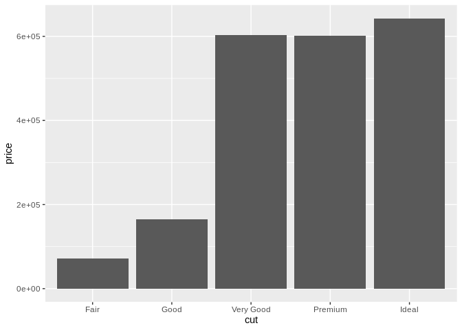

    library(caret)
    library(modeldata)
    library(cowplot)

\#\#Wczytywanie danych.

    data(mlc_churn)
    data <- data.frame(mlc_churn)
    knitr::kable(head(data))

<table style="width:100%;">
<colgroup>
<col style="width: 1%" />
<col style="width: 4%" />
<col style="width: 4%" />
<col style="width: 5%" />
<col style="width: 4%" />
<col style="width: 6%" />
<col style="width: 5%" />
<col style="width: 4%" />
<col style="width: 4%" />
<col style="width: 5%" />
<col style="width: 4%" />
<col style="width: 4%" />
<col style="width: 5%" />
<col style="width: 5%" />
<col style="width: 5%" />
<col style="width: 5%" />
<col style="width: 4%" />
<col style="width: 5%" />
<col style="width: 8%" />
<col style="width: 1%" />
</colgroup>
<thead>
<tr class="header">
<th style="text-align: left;">state</th>
<th style="text-align: right;">account_length</th>
<th style="text-align: left;">area_code</th>
<th style="text-align: left;">international_plan</th>
<th style="text-align: left;">voice_mail_plan</th>
<th style="text-align: right;">number_vmail_messages</th>
<th style="text-align: right;">total_day_minutes</th>
<th style="text-align: right;">total_day_calls</th>
<th style="text-align: right;">total_day_charge</th>
<th style="text-align: right;">total_eve_minutes</th>
<th style="text-align: right;">total_eve_calls</th>
<th style="text-align: right;">total_eve_charge</th>
<th style="text-align: right;">total_night_minutes</th>
<th style="text-align: right;">total_night_calls</th>
<th style="text-align: right;">total_night_charge</th>
<th style="text-align: right;">total_intl_minutes</th>
<th style="text-align: right;">total_intl_calls</th>
<th style="text-align: right;">total_intl_charge</th>
<th style="text-align: right;">number_customer_service_calls</th>
<th style="text-align: left;">churn</th>
</tr>
</thead>
<tbody>
<tr class="odd">
<td style="text-align: left;">KS</td>
<td style="text-align: right;">128</td>
<td style="text-align: left;">area_code_415</td>
<td style="text-align: left;">no</td>
<td style="text-align: left;">yes</td>
<td style="text-align: right;">25</td>
<td style="text-align: right;">265.1</td>
<td style="text-align: right;">110</td>
<td style="text-align: right;">45.07</td>
<td style="text-align: right;">197.4</td>
<td style="text-align: right;">99</td>
<td style="text-align: right;">16.78</td>
<td style="text-align: right;">244.7</td>
<td style="text-align: right;">91</td>
<td style="text-align: right;">11.01</td>
<td style="text-align: right;">10.0</td>
<td style="text-align: right;">3</td>
<td style="text-align: right;">2.70</td>
<td style="text-align: right;">1</td>
<td style="text-align: left;">no</td>
</tr>
<tr class="even">
<td style="text-align: left;">OH</td>
<td style="text-align: right;">107</td>
<td style="text-align: left;">area_code_415</td>
<td style="text-align: left;">no</td>
<td style="text-align: left;">yes</td>
<td style="text-align: right;">26</td>
<td style="text-align: right;">161.6</td>
<td style="text-align: right;">123</td>
<td style="text-align: right;">27.47</td>
<td style="text-align: right;">195.5</td>
<td style="text-align: right;">103</td>
<td style="text-align: right;">16.62</td>
<td style="text-align: right;">254.4</td>
<td style="text-align: right;">103</td>
<td style="text-align: right;">11.45</td>
<td style="text-align: right;">13.7</td>
<td style="text-align: right;">3</td>
<td style="text-align: right;">3.70</td>
<td style="text-align: right;">1</td>
<td style="text-align: left;">no</td>
</tr>
<tr class="odd">
<td style="text-align: left;">NJ</td>
<td style="text-align: right;">137</td>
<td style="text-align: left;">area_code_415</td>
<td style="text-align: left;">no</td>
<td style="text-align: left;">no</td>
<td style="text-align: right;">0</td>
<td style="text-align: right;">243.4</td>
<td style="text-align: right;">114</td>
<td style="text-align: right;">41.38</td>
<td style="text-align: right;">121.2</td>
<td style="text-align: right;">110</td>
<td style="text-align: right;">10.30</td>
<td style="text-align: right;">162.6</td>
<td style="text-align: right;">104</td>
<td style="text-align: right;">7.32</td>
<td style="text-align: right;">12.2</td>
<td style="text-align: right;">5</td>
<td style="text-align: right;">3.29</td>
<td style="text-align: right;">0</td>
<td style="text-align: left;">no</td>
</tr>
<tr class="even">
<td style="text-align: left;">OH</td>
<td style="text-align: right;">84</td>
<td style="text-align: left;">area_code_408</td>
<td style="text-align: left;">yes</td>
<td style="text-align: left;">no</td>
<td style="text-align: right;">0</td>
<td style="text-align: right;">299.4</td>
<td style="text-align: right;">71</td>
<td style="text-align: right;">50.90</td>
<td style="text-align: right;">61.9</td>
<td style="text-align: right;">88</td>
<td style="text-align: right;">5.26</td>
<td style="text-align: right;">196.9</td>
<td style="text-align: right;">89</td>
<td style="text-align: right;">8.86</td>
<td style="text-align: right;">6.6</td>
<td style="text-align: right;">7</td>
<td style="text-align: right;">1.78</td>
<td style="text-align: right;">2</td>
<td style="text-align: left;">no</td>
</tr>
<tr class="odd">
<td style="text-align: left;">OK</td>
<td style="text-align: right;">75</td>
<td style="text-align: left;">area_code_415</td>
<td style="text-align: left;">yes</td>
<td style="text-align: left;">no</td>
<td style="text-align: right;">0</td>
<td style="text-align: right;">166.7</td>
<td style="text-align: right;">113</td>
<td style="text-align: right;">28.34</td>
<td style="text-align: right;">148.3</td>
<td style="text-align: right;">122</td>
<td style="text-align: right;">12.61</td>
<td style="text-align: right;">186.9</td>
<td style="text-align: right;">121</td>
<td style="text-align: right;">8.41</td>
<td style="text-align: right;">10.1</td>
<td style="text-align: right;">3</td>
<td style="text-align: right;">2.73</td>
<td style="text-align: right;">3</td>
<td style="text-align: left;">no</td>
</tr>
<tr class="even">
<td style="text-align: left;">AL</td>
<td style="text-align: right;">118</td>
<td style="text-align: left;">area_code_510</td>
<td style="text-align: left;">yes</td>
<td style="text-align: left;">no</td>
<td style="text-align: right;">0</td>
<td style="text-align: right;">223.4</td>
<td style="text-align: right;">98</td>
<td style="text-align: right;">37.98</td>
<td style="text-align: right;">220.6</td>
<td style="text-align: right;">101</td>
<td style="text-align: right;">18.75</td>
<td style="text-align: right;">203.9</td>
<td style="text-align: right;">118</td>
<td style="text-align: right;">9.18</td>
<td style="text-align: right;">6.3</td>
<td style="text-align: right;">6</td>
<td style="text-align: right;">1.70</td>
<td style="text-align: right;">0</td>
<td style="text-align: left;">no</td>
</tr>
</tbody>
</table>

    knitr::kable(summary(data))

<table style="width:100%;">
<colgroup>
<col style="width: 0%" />
<col style="width: 3%" />
<col style="width: 4%" />
<col style="width: 5%" />
<col style="width: 5%" />
<col style="width: 4%" />
<col style="width: 6%" />
<col style="width: 5%" />
<col style="width: 4%" />
<col style="width: 4%" />
<col style="width: 5%" />
<col style="width: 4%" />
<col style="width: 4%" />
<col style="width: 5%" />
<col style="width: 5%" />
<col style="width: 5%" />
<col style="width: 5%" />
<col style="width: 4%" />
<col style="width: 5%" />
<col style="width: 8%" />
<col style="width: 2%" />
</colgroup>
<thead>
<tr class="header">
<th style="text-align: left;"></th>
<th style="text-align: left;">state</th>
<th style="text-align: left;">account_length</th>
<th style="text-align: left;">area_code</th>
<th style="text-align: left;">international_plan</th>
<th style="text-align: left;">voice_mail_plan</th>
<th style="text-align: left;">number_vmail_messages</th>
<th style="text-align: left;">total_day_minutes</th>
<th style="text-align: left;">total_day_calls</th>
<th style="text-align: left;">total_day_charge</th>
<th style="text-align: left;">total_eve_minutes</th>
<th style="text-align: left;">total_eve_calls</th>
<th style="text-align: left;">total_eve_charge</th>
<th style="text-align: left;">total_night_minutes</th>
<th style="text-align: left;">total_night_calls</th>
<th style="text-align: left;">total_night_charge</th>
<th style="text-align: left;">total_intl_minutes</th>
<th style="text-align: left;">total_intl_calls</th>
<th style="text-align: left;">total_intl_charge</th>
<th style="text-align: left;">number_customer_service_calls</th>
<th style="text-align: left;">churn</th>
</tr>
</thead>
<tbody>
<tr class="odd">
<td style="text-align: left;"></td>
<td style="text-align: left;">WV : 158</td>
<td style="text-align: left;">Min. : 1.0</td>
<td style="text-align: left;">area_code_408:1259</td>
<td style="text-align: left;">no :4527</td>
<td style="text-align: left;">no :3677</td>
<td style="text-align: left;">Min. : 0.000</td>
<td style="text-align: left;">Min. : 0.0</td>
<td style="text-align: left;">Min. : 0</td>
<td style="text-align: left;">Min. : 0.00</td>
<td style="text-align: left;">Min. : 0.0</td>
<td style="text-align: left;">Min. : 0.0</td>
<td style="text-align: left;">Min. : 0.00</td>
<td style="text-align: left;">Min. : 0.0</td>
<td style="text-align: left;">Min. : 0.00</td>
<td style="text-align: left;">Min. : 0.000</td>
<td style="text-align: left;">Min. : 0.00</td>
<td style="text-align: left;">Min. : 0.000</td>
<td style="text-align: left;">Min. :0.000</td>
<td style="text-align: left;">Min. :0.00</td>
<td style="text-align: left;">yes: 707</td>
</tr>
<tr class="even">
<td style="text-align: left;"></td>
<td style="text-align: left;">MN : 125</td>
<td style="text-align: left;">1st Qu.: 73.0</td>
<td style="text-align: left;">area_code_415:2495</td>
<td style="text-align: left;">yes: 473</td>
<td style="text-align: left;">yes:1323</td>
<td style="text-align: left;">1st Qu.: 0.000</td>
<td style="text-align: left;">1st Qu.:143.7</td>
<td style="text-align: left;">1st Qu.: 87</td>
<td style="text-align: left;">1st Qu.:24.43</td>
<td style="text-align: left;">1st Qu.:166.4</td>
<td style="text-align: left;">1st Qu.: 87.0</td>
<td style="text-align: left;">1st Qu.:14.14</td>
<td style="text-align: left;">1st Qu.:166.9</td>
<td style="text-align: left;">1st Qu.: 87.00</td>
<td style="text-align: left;">1st Qu.: 7.510</td>
<td style="text-align: left;">1st Qu.: 8.50</td>
<td style="text-align: left;">1st Qu.: 3.000</td>
<td style="text-align: left;">1st Qu.:2.300</td>
<td style="text-align: left;">1st Qu.:1.00</td>
<td style="text-align: left;">no :4293</td>
</tr>
<tr class="odd">
<td style="text-align: left;"></td>
<td style="text-align: left;">AL : 124</td>
<td style="text-align: left;">Median :100.0</td>
<td style="text-align: left;">area_code_510:1246</td>
<td style="text-align: left;">NA</td>
<td style="text-align: left;">NA</td>
<td style="text-align: left;">Median : 0.000</td>
<td style="text-align: left;">Median :180.1</td>
<td style="text-align: left;">Median :100</td>
<td style="text-align: left;">Median :30.62</td>
<td style="text-align: left;">Median :201.0</td>
<td style="text-align: left;">Median :100.0</td>
<td style="text-align: left;">Median :17.09</td>
<td style="text-align: left;">Median :200.4</td>
<td style="text-align: left;">Median :100.00</td>
<td style="text-align: left;">Median : 9.020</td>
<td style="text-align: left;">Median :10.30</td>
<td style="text-align: left;">Median : 4.000</td>
<td style="text-align: left;">Median :2.780</td>
<td style="text-align: left;">Median :1.00</td>
<td style="text-align: left;">NA</td>
</tr>
<tr class="even">
<td style="text-align: left;"></td>
<td style="text-align: left;">ID : 119</td>
<td style="text-align: left;">Mean :100.3</td>
<td style="text-align: left;">NA</td>
<td style="text-align: left;">NA</td>
<td style="text-align: left;">NA</td>
<td style="text-align: left;">Mean : 7.755</td>
<td style="text-align: left;">Mean :180.3</td>
<td style="text-align: left;">Mean :100</td>
<td style="text-align: left;">Mean :30.65</td>
<td style="text-align: left;">Mean :200.6</td>
<td style="text-align: left;">Mean :100.2</td>
<td style="text-align: left;">Mean :17.05</td>
<td style="text-align: left;">Mean :200.4</td>
<td style="text-align: left;">Mean : 99.92</td>
<td style="text-align: left;">Mean : 9.018</td>
<td style="text-align: left;">Mean :10.26</td>
<td style="text-align: left;">Mean : 4.435</td>
<td style="text-align: left;">Mean :2.771</td>
<td style="text-align: left;">Mean :1.57</td>
<td style="text-align: left;">NA</td>
</tr>
<tr class="odd">
<td style="text-align: left;"></td>
<td style="text-align: left;">VA : 118</td>
<td style="text-align: left;">3rd Qu.:127.0</td>
<td style="text-align: left;">NA</td>
<td style="text-align: left;">NA</td>
<td style="text-align: left;">NA</td>
<td style="text-align: left;">3rd Qu.:17.000</td>
<td style="text-align: left;">3rd Qu.:216.2</td>
<td style="text-align: left;">3rd Qu.:113</td>
<td style="text-align: left;">3rd Qu.:36.75</td>
<td style="text-align: left;">3rd Qu.:234.1</td>
<td style="text-align: left;">3rd Qu.:114.0</td>
<td style="text-align: left;">3rd Qu.:19.90</td>
<td style="text-align: left;">3rd Qu.:234.7</td>
<td style="text-align: left;">3rd Qu.:113.00</td>
<td style="text-align: left;">3rd Qu.:10.560</td>
<td style="text-align: left;">3rd Qu.:12.00</td>
<td style="text-align: left;">3rd Qu.: 6.000</td>
<td style="text-align: left;">3rd Qu.:3.240</td>
<td style="text-align: left;">3rd Qu.:2.00</td>
<td style="text-align: left;">NA</td>
</tr>
<tr class="even">
<td style="text-align: left;"></td>
<td style="text-align: left;">OH : 116</td>
<td style="text-align: left;">Max. :243.0</td>
<td style="text-align: left;">NA</td>
<td style="text-align: left;">NA</td>
<td style="text-align: left;">NA</td>
<td style="text-align: left;">Max. :52.000</td>
<td style="text-align: left;">Max. :351.5</td>
<td style="text-align: left;">Max. :165</td>
<td style="text-align: left;">Max. :59.76</td>
<td style="text-align: left;">Max. :363.7</td>
<td style="text-align: left;">Max. :170.0</td>
<td style="text-align: left;">Max. :30.91</td>
<td style="text-align: left;">Max. :395.0</td>
<td style="text-align: left;">Max. :175.00</td>
<td style="text-align: left;">Max. :17.770</td>
<td style="text-align: left;">Max. :20.00</td>
<td style="text-align: left;">Max. :20.000</td>
<td style="text-align: left;">Max. :5.400</td>
<td style="text-align: left;">Max. :9.00</td>
<td style="text-align: left;">NA</td>
</tr>
<tr class="odd">
<td style="text-align: left;"></td>
<td style="text-align: left;">(Other):4240</td>
<td style="text-align: left;">NA</td>
<td style="text-align: left;">NA</td>
<td style="text-align: left;">NA</td>
<td style="text-align: left;">NA</td>
<td style="text-align: left;">NA</td>
<td style="text-align: left;">NA</td>
<td style="text-align: left;">NA</td>
<td style="text-align: left;">NA</td>
<td style="text-align: left;">NA</td>
<td style="text-align: left;">NA</td>
<td style="text-align: left;">NA</td>
<td style="text-align: left;">NA</td>
<td style="text-align: left;">NA</td>
<td style="text-align: left;">NA</td>
<td style="text-align: left;">NA</td>
<td style="text-align: left;">NA</td>
<td style="text-align: left;">NA</td>
<td style="text-align: left;">NA</td>
<td style="text-align: left;">NA</td>
</tr>
</tbody>
</table>

\#\#Podział na uczący/testowy.

    set.seed(42)
    inTraining <-
        createDataPartition(
            y = data$churn,
            p = .75,
            list = FALSE)

    churn_training <- data[ inTraining,]
    print(nrow(churn_training))

    ## [1] 3751

    churn_testing  <- data[-inTraining,]
    print(nrow(churn_testing))

    ## [1] 1249

\#\#Uczenie Knn oraz Rforest.

    t_ctrl <- trainControl(
      method = "cv",
      classProbs = TRUE,
      summaryFunction = twoClassSummary)

    knnFit <- train(churn ~.,
                    data =churn_training ,
                    method = "knn",
                    #tuneLength = 10,
                    metric = "ROC",
                    trControl = t_ctrl)

    print(knnFit)

    ## k-Nearest Neighbors 
    ## 
    ## 3751 samples
    ##   19 predictor
    ##    2 classes: 'yes', 'no' 
    ## 
    ## No pre-processing
    ## Resampling: Cross-Validated (10 fold) 
    ## Summary of sample sizes: 3376, 3375, 3376, 3376, 3376, 3376, ... 
    ## Resampling results across tuning parameters:
    ## 
    ##   k  ROC        Sens       Spec     
    ##   5  0.6797628  0.2937806  0.9801242
    ##   7  0.6855204  0.2863033  0.9878882
    ##   9  0.6940851  0.2618099  0.9897516
    ## 
    ## ROC was used to select the optimal model using the largest value.
    ## The final value used for the model was k = 9.

    rfFit <- train(churn ~.,
                   data =churn_training ,
                   method = "rf",
                   trControl = t_ctrl,
                   metric = "ROC",
                   ntree = 10)
    print(rfFit)

    ## Random Forest 
    ## 
    ## 3751 samples
    ##   19 predictor
    ##    2 classes: 'yes', 'no' 
    ## 
    ## No pre-processing
    ## Resampling: Cross-Validated (10 fold) 
    ## Summary of sample sizes: 3376, 3376, 3376, 3376, 3376, 3376, ... 
    ## Resampling results across tuning parameters:
    ## 
    ##   mtry  ROC        Sens       Spec     
    ##    2    0.8459610  0.2071279  0.9950311
    ##   35    0.9060378  0.7288609  0.9863354
    ##   69    0.9007150  0.7157582  0.9835404
    ## 
    ## ROC was used to select the optimal model using the largest value.
    ## The final value used for the model was mtry = 35.

    svmbFit <- train(churn ~.,
                   data =churn_training ,
                   method = "svmRadial",
                   metric = "ROC",
                   trControl = t_ctrl)
    print(svmbFit)

    ## Support Vector Machines with Radial Basis Function Kernel 
    ## 
    ## 3751 samples
    ##   19 predictor
    ##    2 classes: 'yes', 'no' 
    ## 
    ## No pre-processing
    ## Resampling: Cross-Validated (10 fold) 
    ## Summary of sample sizes: 3376, 3376, 3376, 3376, 3376, 3375, ... 
    ## Resampling results across tuning parameters:
    ## 
    ##   C     ROC        Sens       Spec     
    ##   0.25  0.8597160  0.4464710  0.9658385
    ##   0.50  0.8598336  0.4465409  0.9661491
    ##   1.00  0.8598042  0.4408805  0.9673913
    ## 
    ## Tuning parameter 'sigma' was held constant at a value of 0.007335127
    ## ROC was used to select the optimal model using the largest value.
    ## The final values used for the model were sigma = 0.007335127 and C = 0.5.

\#\#Wyniki na zbiorze testowym.

    print("KNN:")

    ## [1] "KNN:"

    knnClasses <- predict(knnFit, newdata = churn_testing)
    confusionMatrix(data = knnClasses, churn_testing$churn)

    ## Confusion Matrix and Statistics
    ## 
    ##           Reference
    ## Prediction  yes   no
    ##        yes   44   13
    ##        no   132 1060
    ##                                           
    ##                Accuracy : 0.8839          
    ##                  95% CI : (0.8648, 0.9012)
    ##     No Information Rate : 0.8591          
    ##     P-Value [Acc > NIR] : 0.005618        
    ##                                           
    ##                   Kappa : 0.3316          
    ##                                           
    ##  Mcnemar's Test P-Value : < 2.2e-16       
    ##                                           
    ##             Sensitivity : 0.25000         
    ##             Specificity : 0.98788         
    ##          Pos Pred Value : 0.77193         
    ##          Neg Pred Value : 0.88926         
    ##              Prevalence : 0.14091         
    ##          Detection Rate : 0.03523         
    ##    Detection Prevalence : 0.04564         
    ##       Balanced Accuracy : 0.61894         
    ##                                           
    ##        'Positive' Class : yes             
    ## 

    print("RANDOM FOREST:")

    ## [1] "RANDOM FOREST:"

    rfClasses <- predict(rfFit, newdata = churn_testing)
    confusionMatrix(data = rfClasses, churn_testing$churn)

    ## Confusion Matrix and Statistics
    ## 
    ##           Reference
    ## Prediction  yes   no
    ##        yes  134   22
    ##        no    42 1051
    ##                                          
    ##                Accuracy : 0.9488         
    ##                  95% CI : (0.935, 0.9603)
    ##     No Information Rate : 0.8591         
    ##     P-Value [Acc > NIR] : < 2e-16        
    ##                                          
    ##                   Kappa : 0.7778         
    ##                                          
    ##  Mcnemar's Test P-Value : 0.01755        
    ##                                          
    ##             Sensitivity : 0.7614         
    ##             Specificity : 0.9795         
    ##          Pos Pred Value : 0.8590         
    ##          Neg Pred Value : 0.9616         
    ##              Prevalence : 0.1409         
    ##          Detection Rate : 0.1073         
    ##    Detection Prevalence : 0.1249         
    ##       Balanced Accuracy : 0.8704         
    ##                                          
    ##        'Positive' Class : yes            
    ## 

    print("SVM:")

    ## [1] "SVM:"

    svmClasses <- predict(svmbFit, newdata = churn_testing)
    confusionMatrix(data = svmClasses, churn_testing$churn)

    ## Confusion Matrix and Statistics
    ## 
    ##           Reference
    ## Prediction  yes   no
    ##        yes   88   42
    ##        no    88 1031
    ##                                           
    ##                Accuracy : 0.8959          
    ##                  95% CI : (0.8776, 0.9123)
    ##     No Information Rate : 0.8591          
    ##     P-Value [Acc > NIR] : 6.122e-05       
    ##                                           
    ##                   Kappa : 0.5174          
    ##                                           
    ##  Mcnemar's Test P-Value : 7.922e-05       
    ##                                           
    ##             Sensitivity : 0.50000         
    ##             Specificity : 0.96086         
    ##          Pos Pred Value : 0.67692         
    ##          Neg Pred Value : 0.92136         
    ##              Prevalence : 0.14091         
    ##          Detection Rate : 0.07046         
    ##    Detection Prevalence : 0.10408         
    ##       Balanced Accuracy : 0.73043         
    ##                                           
    ##        'Positive' Class : yes             
    ## 

\#\#PREPROCESSING Uważam, że przetwarzanie wstępne może pomóc i jeśli
jest możliwe to jest wskazane. Niektóre algorytmy są bardzo podatne na
dane z wartościami o różnych zakresach. Dla niektórych algorytmów,
takich jak Random Forest, przetwarzanie wstępne nie wpłynie na wynik
końcowy. Poniżej zamiesciłem przykład preprocessingu dla SVM który
poprawił wynik ACC o kilka setnych.

    t_ctrl <- trainControl(
      method = "cv",
      classProbs = TRUE,
      summaryFunction = twoClassSummary)

    svmFitp <- train(churn ~.,
                    data =churn_training ,
                    method = "svmRadial",
                    preProc =c("center", "scale", "nzv"),
                    metric = "ROC",
                    trControl = t_ctrl)

    print("SVM:")

    ## [1] "SVM:"

    svmClasses <- predict(svmFitp, newdata = churn_testing)
    confusionMatrix(data = svmClasses, churn_testing$churn)

    ## Confusion Matrix and Statistics
    ## 
    ##           Reference
    ## Prediction  yes   no
    ##        yes  107   17
    ##        no    69 1056
    ##                                           
    ##                Accuracy : 0.9311          
    ##                  95% CI : (0.9157, 0.9446)
    ##     No Information Rate : 0.8591          
    ##     P-Value [Acc > NIR] : 9.348e-16       
    ##                                           
    ##                   Kappa : 0.6755          
    ##                                           
    ##  Mcnemar's Test P-Value : 3.809e-08       
    ##                                           
    ##             Sensitivity : 0.60795         
    ##             Specificity : 0.98416         
    ##          Pos Pred Value : 0.86290         
    ##          Neg Pred Value : 0.93867         
    ##              Prevalence : 0.14091         
    ##          Detection Rate : 0.08567         
    ##    Detection Prevalence : 0.09928         
    ##       Balanced Accuracy : 0.79606         
    ##                                           
    ##        'Positive' Class : yes             
    ## 

\#\#Zmiana hiperparametrów

    gridCtrl <- trainControl(
        method = "repeatedcv",
        summaryFunction = twoClassSummary,
        classProbs = TRUE,
        number = 2,
        repeats = 5)

    rfGrid <- expand.grid(mtry = 5:20)
    rfFitTune <- train(churn ~.,
                 data =churn_training ,
                 method = "rf",
                 metric = "ROC",
                 preProc = c("center", "scale"),
                 trControl = gridCtrl,
                 tuneGrid = rfGrid,
                 ntree = 20)

    knnGrid <- expand.grid(k = 1:15)
    knnFitTune <- train(churn ~.,
                 data =churn_training ,
                 method = "knn",
                 metric = "ROC",
                 preProc = c("center", "scale"),
                 trControl = gridCtrl,
                 tuneGrid = knnGrid)

    #svmGrid <- expand.grid( sigma =c(0.0001,0.01,1),C = c(0.1,1,10,100)
    #                       )
    #svmFitTune <- train(churn ~.,
    #              data =churn_training ,
    #               method = "svmRadial",
    #               metric = "ROC",
    #               trControl = t_ctrl,
    #               tuneGrid = svmGrid)
    #print(svnFitTune)

\#\#Porównanie wyników Poniżej porzedstawiono wykresy porównań dwóch
klasyfikatorów. Jak widać w tym zestawieniu, lepsze wyniki w skali ROC
osiąga RandomForest.

    resamps <- resamples(list(KNN = knnFitTune,
                              RandomForest = rfFitTune))

    dp<- dotplot(resamps,
            scales =list(x = list(relation = "free")),
            between = list(x = 2))

    bp<- bwplot(resamps,
           metric = "ROC")

    densp<- densityplot(resamps,
                auto.key = list(columns = 2),
                pch = "|")

    #xyplot(resamps,
    #       models = c("KNN", "RandomForest"),
    #       metric = "ROC")

    #splom(resamps, metric = "ROC")
    #splom(resamps, variables = "metrics")

    #parallelplot(resamps, metric = "ROC")

    print(dp)

    print(bp)

    print(densp)

 \#CZĘŚĆ 2

    library(ggplot2)
    library(dplyr)

\#\#Wczytywanie danych.

    data(diamonds)
    data <- data.frame(diamonds)
    knitr::kable(head(data))

<table>
<thead>
<tr class="header">
<th style="text-align: right;">carat</th>
<th style="text-align: left;">cut</th>
<th style="text-align: left;">color</th>
<th style="text-align: left;">clarity</th>
<th style="text-align: right;">depth</th>
<th style="text-align: right;">table</th>
<th style="text-align: right;">price</th>
<th style="text-align: right;">x</th>
<th style="text-align: right;">y</th>
<th style="text-align: right;">z</th>
</tr>
</thead>
<tbody>
<tr class="odd">
<td style="text-align: right;">0.23</td>
<td style="text-align: left;">Ideal</td>
<td style="text-align: left;">E</td>
<td style="text-align: left;">SI2</td>
<td style="text-align: right;">61.5</td>
<td style="text-align: right;">55</td>
<td style="text-align: right;">326</td>
<td style="text-align: right;">3.95</td>
<td style="text-align: right;">3.98</td>
<td style="text-align: right;">2.43</td>
</tr>
<tr class="even">
<td style="text-align: right;">0.21</td>
<td style="text-align: left;">Premium</td>
<td style="text-align: left;">E</td>
<td style="text-align: left;">SI1</td>
<td style="text-align: right;">59.8</td>
<td style="text-align: right;">61</td>
<td style="text-align: right;">326</td>
<td style="text-align: right;">3.89</td>
<td style="text-align: right;">3.84</td>
<td style="text-align: right;">2.31</td>
</tr>
<tr class="odd">
<td style="text-align: right;">0.23</td>
<td style="text-align: left;">Good</td>
<td style="text-align: left;">E</td>
<td style="text-align: left;">VS1</td>
<td style="text-align: right;">56.9</td>
<td style="text-align: right;">65</td>
<td style="text-align: right;">327</td>
<td style="text-align: right;">4.05</td>
<td style="text-align: right;">4.07</td>
<td style="text-align: right;">2.31</td>
</tr>
<tr class="even">
<td style="text-align: right;">0.29</td>
<td style="text-align: left;">Premium</td>
<td style="text-align: left;">I</td>
<td style="text-align: left;">VS2</td>
<td style="text-align: right;">62.4</td>
<td style="text-align: right;">58</td>
<td style="text-align: right;">334</td>
<td style="text-align: right;">4.20</td>
<td style="text-align: right;">4.23</td>
<td style="text-align: right;">2.63</td>
</tr>
<tr class="odd">
<td style="text-align: right;">0.31</td>
<td style="text-align: left;">Good</td>
<td style="text-align: left;">J</td>
<td style="text-align: left;">SI2</td>
<td style="text-align: right;">63.3</td>
<td style="text-align: right;">58</td>
<td style="text-align: right;">335</td>
<td style="text-align: right;">4.34</td>
<td style="text-align: right;">4.35</td>
<td style="text-align: right;">2.75</td>
</tr>
<tr class="even">
<td style="text-align: right;">0.24</td>
<td style="text-align: left;">Very Good</td>
<td style="text-align: left;">J</td>
<td style="text-align: left;">VVS2</td>
<td style="text-align: right;">62.8</td>
<td style="text-align: right;">57</td>
<td style="text-align: right;">336</td>
<td style="text-align: right;">3.94</td>
<td style="text-align: right;">3.96</td>
<td style="text-align: right;">2.48</td>
</tr>
</tbody>
</table>

    knitr::kable(summary(data))

<table>
<colgroup>
<col style="width: 2%" />
<col style="width: 10%" />
<col style="width: 11%" />
<col style="width: 5%" />
<col style="width: 9%" />
<col style="width: 9%" />
<col style="width: 9%" />
<col style="width: 9%" />
<col style="width: 10%" />
<col style="width: 10%" />
<col style="width: 10%" />
</colgroup>
<thead>
<tr class="header">
<th style="text-align: left;"></th>
<th style="text-align: left;">carat</th>
<th style="text-align: left;">cut</th>
<th style="text-align: left;">color</th>
<th style="text-align: left;">clarity</th>
<th style="text-align: left;">depth</th>
<th style="text-align: left;">table</th>
<th style="text-align: left;">price</th>
<th style="text-align: left;">x</th>
<th style="text-align: left;">y</th>
<th style="text-align: left;">z</th>
</tr>
</thead>
<tbody>
<tr class="odd">
<td style="text-align: left;"></td>
<td style="text-align: left;">Min. :0.2000</td>
<td style="text-align: left;">Fair : 1610</td>
<td style="text-align: left;">D: 6775</td>
<td style="text-align: left;">SI1 :13065</td>
<td style="text-align: left;">Min. :43.00</td>
<td style="text-align: left;">Min. :43.00</td>
<td style="text-align: left;">Min. : 326</td>
<td style="text-align: left;">Min. : 0.000</td>
<td style="text-align: left;">Min. : 0.000</td>
<td style="text-align: left;">Min. : 0.000</td>
</tr>
<tr class="even">
<td style="text-align: left;"></td>
<td style="text-align: left;">1st Qu.:0.4000</td>
<td style="text-align: left;">Good : 4906</td>
<td style="text-align: left;">E: 9797</td>
<td style="text-align: left;">VS2 :12258</td>
<td style="text-align: left;">1st Qu.:61.00</td>
<td style="text-align: left;">1st Qu.:56.00</td>
<td style="text-align: left;">1st Qu.: 950</td>
<td style="text-align: left;">1st Qu.: 4.710</td>
<td style="text-align: left;">1st Qu.: 4.720</td>
<td style="text-align: left;">1st Qu.: 2.910</td>
</tr>
<tr class="odd">
<td style="text-align: left;"></td>
<td style="text-align: left;">Median :0.7000</td>
<td style="text-align: left;">Very Good:12082</td>
<td style="text-align: left;">F: 9542</td>
<td style="text-align: left;">SI2 : 9194</td>
<td style="text-align: left;">Median :61.80</td>
<td style="text-align: left;">Median :57.00</td>
<td style="text-align: left;">Median : 2401</td>
<td style="text-align: left;">Median : 5.700</td>
<td style="text-align: left;">Median : 5.710</td>
<td style="text-align: left;">Median : 3.530</td>
</tr>
<tr class="even">
<td style="text-align: left;"></td>
<td style="text-align: left;">Mean :0.7979</td>
<td style="text-align: left;">Premium :13791</td>
<td style="text-align: left;">G:11292</td>
<td style="text-align: left;">VS1 : 8171</td>
<td style="text-align: left;">Mean :61.75</td>
<td style="text-align: left;">Mean :57.46</td>
<td style="text-align: left;">Mean : 3933</td>
<td style="text-align: left;">Mean : 5.731</td>
<td style="text-align: left;">Mean : 5.735</td>
<td style="text-align: left;">Mean : 3.539</td>
</tr>
<tr class="odd">
<td style="text-align: left;"></td>
<td style="text-align: left;">3rd Qu.:1.0400</td>
<td style="text-align: left;">Ideal :21551</td>
<td style="text-align: left;">H: 8304</td>
<td style="text-align: left;">VVS2 : 5066</td>
<td style="text-align: left;">3rd Qu.:62.50</td>
<td style="text-align: left;">3rd Qu.:59.00</td>
<td style="text-align: left;">3rd Qu.: 5324</td>
<td style="text-align: left;">3rd Qu.: 6.540</td>
<td style="text-align: left;">3rd Qu.: 6.540</td>
<td style="text-align: left;">3rd Qu.: 4.040</td>
</tr>
<tr class="even">
<td style="text-align: left;"></td>
<td style="text-align: left;">Max. :5.0100</td>
<td style="text-align: left;">NA</td>
<td style="text-align: left;">I: 5422</td>
<td style="text-align: left;">VVS1 : 3655</td>
<td style="text-align: left;">Max. :79.00</td>
<td style="text-align: left;">Max. :95.00</td>
<td style="text-align: left;">Max. :18823</td>
<td style="text-align: left;">Max. :10.740</td>
<td style="text-align: left;">Max. :58.900</td>
<td style="text-align: left;">Max. :31.800</td>
</tr>
<tr class="odd">
<td style="text-align: left;"></td>
<td style="text-align: left;">NA</td>
<td style="text-align: left;">NA</td>
<td style="text-align: left;">J: 2808</td>
<td style="text-align: left;">(Other): 2531</td>
<td style="text-align: left;">NA</td>
<td style="text-align: left;">NA</td>
<td style="text-align: left;">NA</td>
<td style="text-align: left;">NA</td>
<td style="text-align: left;">NA</td>
<td style="text-align: left;">NA</td>
</tr>
</tbody>
</table>

\#\#Dzielenie danych na zbiór trenignowy i testowy

    set.seed(42)
    inTraining <-
        createDataPartition(
            y = data$price,
            p = .70,
            list = FALSE)

    diam_training <- data[ inTraining,]
    print(nrow(diam_training))

    ## [1] 37759

    diam_testing  <- data[-inTraining,]
    print(nrow(diam_testing))

    ## [1] 16181

\#\#Uczenie modelu regresji

    t_ctrl <- trainControl(
      method = "cv")

    enetFit <- train(price ~.,
                    data =diam_training ,
                    method = "enet",
                    trControl = t_ctrl)

    print(enetFit)

    ## Elasticnet 
    ## 
    ## 37759 samples
    ##     9 predictor
    ## 
    ## No pre-processing
    ## Resampling: Cross-Validated (10 fold) 
    ## Summary of sample sizes: 33983, 33983, 33983, 33982, 33983, 33983, ... 
    ## Resampling results across tuning parameters:
    ## 
    ##   lambda  fraction  RMSE      Rsquared   MAE      
    ##   0e+00   0.050     3538.142  0.8489568  2649.5884
    ##   0e+00   0.525     1236.002  0.9060067   798.4779
    ##   0e+00   1.000     1136.872  0.9190996   746.0500
    ##   1e-04   0.050     3539.569  0.8489568  2650.7890
    ##   1e-04   0.525     1237.505  0.9058162   798.7919
    ##   1e-04   1.000     1136.847  0.9191032   746.4570
    ##   1e-01   0.050     3683.300  0.8489568  2771.6931
    ##   1e-01   0.525     1612.393  0.8418950  1060.0485
    ##   1e-01   1.000     1352.137  0.8874184  1007.1666
    ## 
    ## RMSE was used to select the optimal model using the smallest value.
    ## The final values used for the model were fraction = 1 and lambda = 1e-04.

\#\#Testowanie modelu regresji

    x_test <- diam_testing[, names(diam_testing) != 'price']
    y_test <- diam_testing$price

    predictions <- predict(enetFit, x_test)

    RMSE(predictions, y_test)

    ## [1] 1116.102

\#\#Ważność zmiennych Jak widać, według varImp, najistotniejsze zmienne
to carat oraz x,y,z

    gbmImp <- varImp(enetFit, scale = FALSE)
    plot(gbmImp)

    data_plot <- sample_n(data, 500)
    featurePlot(x = data_plot[, c("depth", "table","carat", "x", "y", "z")],
                y = data_plot$price,
                plot = "scatter",
                type = c("p", "smooth"),
               )

    ggplot(data_plot,aes(y=price,x=color))+geom_col()

    ggplot(data_plot,aes(y=price,x=clarity))+geom_col()

    ggplot(data_plot,aes(y=price,x=cut))+geom_col()

