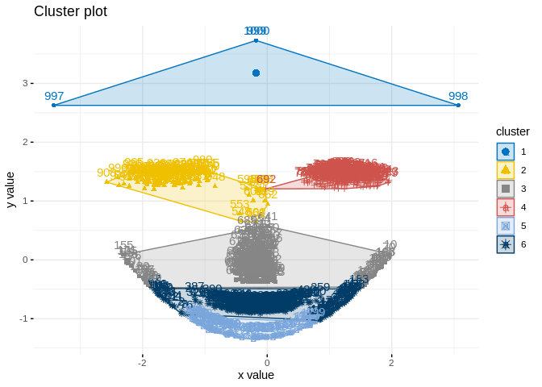

    library(fpc)
    library(ggplot2)
    library(cowplot)
    library(factoextra)
    library(fpc)
    library(NbClust)
    library(caret)
    library(aricode)
    library(expss)

\#\#Wczytywanie danych.

    set.seed(23)
    face <- rFace(1000, p=2, dMoNo=3)
    df = data.frame(x=face[,1], y=face[,2])
    labels = as.integer(attr(face,"grouping"))
    uniueL = length(unique(labels))
    names = c(1,2,3,4,5,6)

    ggplot(df, aes(x, y, )) + 
        geom_point() + 
        theme_bw()

    summary(df)

    ##        x                 y          
    ##  Min.   :-4.5000   Min.   :-0.2269  
    ##  1st Qu.:-0.4242   1st Qu.: 3.1009  
    ##  Median : 0.1017   Median : 6.2044  
    ##  Mean   : 0.2474   Mean   : 8.3469  
    ##  3rd Qu.: 1.4330   3rd Qu.:16.6272  
    ##  Max.   : 4.5000   Max.   :32.0000

\#\#Analiza różnych algorytmmów. \#\#\# Kmedois

    kMedois <- eclust(df, "pam", k = uniueL, graph = F)
    fviz_cluster(kMedois, palette = "jco", ggtheme = theme_minimal())

    confusionMatrix(table(labels, kMedois$cluster),row.names=names, col.names=names)

    ## Confusion Matrix and Statistics
    ## 
    ##       
    ## labels   1   2   3   4   5   6
    ##      1  88  61  12  38   0   0
    ##      2   0   0   0   0   0 100
    ##      3   0 299   0   0   0   0
    ##      4   0   0  70 117   7   5
    ##      5   0   0   0   0 199   0
    ##      6   0   0   0   0   3   1
    ## 
    ## Overall Statistics
    ##                                           
    ##                Accuracy : 0.405           
    ##                  95% CI : (0.3744, 0.4362)
    ##     No Information Rate : 0.36            
    ##     P-Value [Acc > NIR] : 0.001803        
    ##                                           
    ##                   Kappa : 0.2993          
    ##                                           
    ##  Mcnemar's Test P-Value : NA              
    ## 
    ## Statistics by Class:
    ## 
    ##                      Class: 1 Class: 2 Class: 3 Class: 4 Class: 5 Class: 6
    ## Sensitivity            1.0000   0.0000   0.0000   0.7548   0.9522 0.009434
    ## Specificity            0.8783   0.8438   0.6743   0.9030   1.0000 0.996644
    ## Pos Pred Value         0.4422   0.0000   0.0000   0.5879   1.0000 0.250000
    ## Neg Pred Value         1.0000   0.6000   0.8830   0.9526   0.9875 0.894578
    ## Prevalence             0.0880   0.3600   0.0820   0.1550   0.2090 0.106000
    ## Detection Rate         0.0880   0.0000   0.0000   0.1170   0.1990 0.001000
    ## Detection Prevalence   0.1990   0.1000   0.2990   0.1990   0.1990 0.004000
    ## Balanced Accuracy      0.9391   0.4219   0.3371   0.8289   0.9761 0.503039

### KMeans

    kmModel <- eclust(df, "kmeans", k = uniueL, nstart = 25, graph = F)
    fviz_cluster(kmModel, palette = "jco", ggtheme = theme_minimal())

    fviz_silhouette(kmModel, palette = "jco", ggtheme = theme_classic(), print.summary = F)

    confusionMatrix(table(labels, kmModel$cluster),row.names=names, col.names=names)

    ## Confusion Matrix and Statistics
    ## 
    ##       
    ## labels   1   2   3   4   5   6
    ##      1   0   0  46   0  93  60
    ##      2   0 100   0   0   0   0
    ##      3   0   0   0   0   0 299
    ##      4   0  14 184   1   0   0
    ##      5   0   0   0 199   0   0
    ##      6   4   0   0   0   0   0
    ## 
    ## Overall Statistics
    ##                                          
    ##                Accuracy : 0.101          
    ##                  95% CI : (0.083, 0.1214)
    ##     No Information Rate : 0.359          
    ##     P-Value [Acc > NIR] : 1              
    ##                                          
    ##                   Kappa : -0.0462        
    ##                                          
    ##  Mcnemar's Test P-Value : NA             
    ## 
    ## Statistics by Class:
    ## 
    ##                      Class: 1 Class: 2 Class: 3 Class: 4 Class: 5 Class: 6
    ## Sensitivity            0.0000   0.8772   0.0000 0.005000   0.0000   0.0000
    ## Specificity            0.8002   1.0000   0.6117 0.752500   0.7806   0.9938
    ## Pos Pred Value         0.0000   1.0000   0.0000 0.005025   0.0000   0.0000
    ## Neg Pred Value         0.9950   0.9844   0.6719 0.751561   0.8839   0.6396
    ## Prevalence             0.0040   0.1140   0.2300 0.200000   0.0930   0.3590
    ## Detection Rate         0.0000   0.1000   0.0000 0.001000   0.0000   0.0000
    ## Detection Prevalence   0.1990   0.1000   0.2990 0.199000   0.1990   0.0040
    ## Balanced Accuracy      0.4001   0.9386   0.3058 0.378750   0.3903   0.4969

### AHC

    ahcModel <- eclust(df, "hclust", k = uniueL, hc_metric = "euclidean", hc_method = "ward.D2", graph = F)
    fviz_cluster(ahcModel, palette = "jco", ggtheme = theme_minimal())

    fviz_dend(ahcModel, show_labels = F, palette = "jco", as.ggplot = T)

    fviz_silhouette(ahcModel, palette = "jco", ggtheme = theme_classic(), print.summary = F)

    confusionMatrix(table(labels, ahcModel$cluster),row.names=names, col.names=names)

    ## Confusion Matrix and Statistics
    ## 
    ##       
    ## labels   1   2   3   4   5   6
    ##      1  84  68  47   0   0   0
    ##      2   0   0   0   0 100   0
    ##      3   0 299   0   0   0   0
    ##      4   0   0 188  11   0   0
    ##      5   0   0   0 199   0   0
    ##      6   0   0   0   0   0   4
    ## 
    ## Overall Statistics
    ##                                           
    ##                Accuracy : 0.099           
    ##                  95% CI : (0.0812, 0.1192)
    ##     No Information Rate : 0.367           
    ##     P-Value [Acc > NIR] : 1               
    ##                                           
    ##                   Kappa : -0.106          
    ##                                           
    ##  Mcnemar's Test P-Value : NA              
    ## 
    ## Statistics by Class:
    ## 
    ##                      Class: 1 Class: 2 Class: 3 Class: 4 Class: 5 Class: 6
    ## Sensitivity            1.0000   0.0000   0.0000  0.05238   0.0000    1.000
    ## Specificity            0.8745   0.8420   0.6092  0.76203   0.7789    1.000
    ## Pos Pred Value         0.4221   0.0000   0.0000  0.05528   0.0000    1.000
    ## Neg Pred Value         1.0000   0.5922   0.6648  0.75156   0.8752    1.000
    ## Prevalence             0.0840   0.3670   0.2350  0.21000   0.1000    0.004
    ## Detection Rate         0.0840   0.0000   0.0000  0.01100   0.0000    0.004
    ## Detection Prevalence   0.1990   0.1000   0.2990  0.19900   0.1990    0.004
    ## Balanced Accuracy      0.9372   0.4210   0.3046  0.40720   0.3894    1.000

Porównanie liczbowe
-------------------

    amis <- c(AMI(kMedois$cluster, labels),AMI(kmModel$cluster, labels),AMI(ahcModel$cluster, labels))
    algs <- c("K Medois","KMeans","AHC")
    data.frame(Algorytm=algs,
               AMI=amis
    )%>% knitr::kable()

<table>
<thead>
<tr class="header">
<th style="text-align: left;">Algorytm</th>
<th style="text-align: right;">AMI</th>
</tr>
</thead>
<tbody>
<tr class="odd">
<td style="text-align: left;">K Medois</td>
<td style="text-align: right;">0.7440690</td>
</tr>
<tr class="even">
<td style="text-align: left;">KMeans</td>
<td style="text-align: right;">0.7933811</td>
</tr>
<tr class="odd">
<td style="text-align: left;">AHC</td>
<td style="text-align: right;">0.7865455</td>
</tr>
</tbody>
</table>
